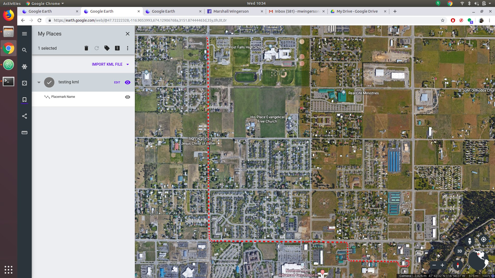

# LemurRescue

This program is being developed as a proof of concept payload with the goal to try to automate a Search and Rescue on drones.

The GPS side of the program can be found here: https://github.com/mwingerson/GPSDecoder

2019/07/14 - Basic operation acheived but many false positives. The program can save an images with current GPS location locally. The OpenCV HOG Defaults need to be adjusted to reject non-humans.

To Do:
- Adjust HOG parameters
- Make the GPSDecoder an external github submodule
- Place GPS details in frame
- Find better solution for embedding GPS data into frame without damaging pixels

